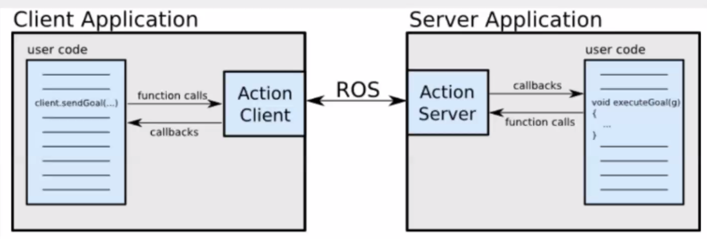

# Action
+ ROS Action는 Service와 다르게 비동기식 통신
  
  + ROS actionlib는 ROS 메시지 위에 구축된 ROS Action Protocol을 통해 통신하는 두 노드(action client와 action server) 간의 요청/응답 상호 작용을 허용
  
  + 그런 다음 클라이언트와 서버는 사용자가 함수 호출 및 **콜백**을 통해 목표(클라이언트 측)를 요청하거나 목표(서버 측)를 실행할 수 있는 간단한 API를 제공

<p align="center">
    </img>
</p>

+ Goal: "관절을 90도로 이동"과 같이 작업 클라이언트가 작업 서버로 보낸 요청
  
+ Feedback: "요청이 처리되는 동안 액션 서버가 액션 클라이언트로 피드백하는 정보(예: 이동 중인 관절의 현재 값")
+ Result: 요청이 이행된 후 작업 서버에서 작업 클라이언트로 전송되는 최종 정보이며 계산 결과

## Custom Action
package에 action 폴더를 만든 후 .action으로 file을 만들면 됨
+ 구성
```python
# goal definition
msg_type msg_name
---
# result definition
msg_type msg_name
---
# feedback
msg_type msg_name
```

### CMakeLists.txt
```cmake
find_package(catkin REQUIRED COMPONENTS
    ...
    actionlib
    actionlib_msgs
    message_generation
    ...
)

add_action_files(
    FILES
    action_name.action
    ...
)

generate_messages(
    DEPENDENCIES
    actionlib_msgs
)

add_dependencies(node_name 
    ${catkin_EXPORTED_TARGETS} ${${PROJECT_NAME}_EXPORTED_TARGETS})
```


### package.xml
```xml
<depend>actionlib</depend>
<depend>actionlib_msgs</depend>
```


## Action Server
+ __executeCB: 클라이언트에서 goal이 들어오면, 집행하는 콜백 함수__
  + 액션 콜백은 모든 처리가 완료되는 곳
  + 목표 값에 도달하거나 작업이 선점될 때까지 반복
  + 현재 값이 목표 값에 도달하면 최종 결과가 result 변수에 저장되고 성공이 publish 됨 (setSucceeded 사용)

  + 그렇지 않으면 현재 결과가 feedback 변수에 저장되고 publish됨 (publishFeedback 사용)

+ preemptCB: preemption에 도달하면 작동하는 콜백 함수 (잘 사용하지 않음)
  + setPreempted 사용
