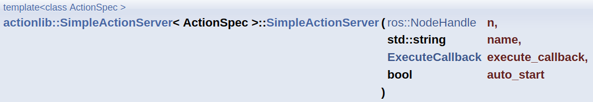

# Demo Action Server
```cpp
#include "ros/ros.h"
#include "std_msgs/Int32.h"
#include <actionlib/server/simple_action_server.h>
#include "demo_action_ex/Demo_actionAction.h"
#include <iostream>
#include <sstream>

class Demo_actionAction
{
protected:
 ros::NodeHandle nh_;
 // NodeHandle instance must be created before this line. Otherwise strange error may occur.
 actionlib::SimpleActionServer<demo_action_ex::Demo_actionAction> as;
 // create messages that are used to published feedback/result
 demo_action_ex::Demo_actionFeedback feedback;
 demo_action_ex::Demo_actionResult result;

 std::string action_name;
 int progress;

public:
 Demo_actionAction(std::string name) :
   as(nh_, name, boost::bind(&Demo_actionAction::executeCB, this, _1), false),
   action_name(name)
 {
     as.registerPreemptCallback(boost::bind(&Demo_actionAction::preemptCB, this));
     as.start();
 }

 ~Demo_actionAction(void)
 {
 }

 void preemptCB()
 {
   ROS_WARN("%s got preempted!", action_name.c_str());
   result.final_count = progress;
   as.setPreempted(result,"I got Preempted");
 }

 void executeCB(const demo_action_ex::Demo_actionGoalConstPtr &goal)
 {
   if(!as.isActive() || as.isPreemptRequested()) return;
   ros::Rate rate(5);
   ROS_INFO("%s is processing the goal %d", action_name.c_str(), goal->count);
   for(progress = 1 ; progress <= goal->count; progress++){
     //Check for ros
     if(!ros::ok()){
       result.final_count = progress;
       as.setAborted(result,"I failed !");
       ROS_INFO("%s Shutting down",action_name.c_str());
       break;
     }

     if(!as.isActive() || as.isPreemptRequested()){
       return;
     }

     if(goal->count <= progress){
       ROS_INFO("%s Succeeded at getting to goal %d", action_name.c_str(), goal->count);
       result.final_count = progress;
       as.setSucceeded(result);
     }else{
       ROS_INFO("Setting to goal %d / %d",feedback.current_number,goal->count);
       feedback.current_number = progress;
       as.publishFeedback(feedback);
     }
     rate.sleep();
   }
 }
};

int main(int argc, char** argv)
{
 ros::init(argc, argv, "demo_action");
 ROS_INFO("Starting Demo Action Server");
 ROS_INFO_STREAM(ros::this_node::getName());
 Demo_actionAction demo_action_obj(ros::this_node::getName());

 ros::spin();
 return 0;
}
```

## 구체적 분석

actionlib::SimpleActionServer라는 actionserver object를 만들기 위한 include
```cpp
#include <actionlib/server/simple_action_server.h>
```

custom action을 include
```cpp
#include "demo_action_ex/Demo_actionAction.h"
```

+ Action Server는 class로 만들어야 함
```cpp
class Demo_actionAction
```

### protected
```cpp
protected:
 ros::NodeHandle nh_;
 // NodeHandle instance must be created before this line. Otherwise strange error may occur.
 actionlib::SimpleActionServer<demo_action_ex::Demo_actionAction> as;
 // create messages that are used to published feedback/result
 demo_action_ex::Demo_actionFeedback feedback;
 demo_action_ex::Demo_actionResult result;

 std::string action_name;
 int progress;
```

+ nodehandler
+ action server object

custom action을 담은 ActionServer object as 생성
```cpp
actionlib::SimpleActionServer<demo_action_ex::Demo_actionAction> as;
```

action server 형식
```cpp
actionlib::SimpleActionServer<package_name::action_name> as;
```

+ feedback, result

custom action 의 feedback과 result object 생성
```cpp
demo_action_ex::Demo_actionFeedback feedback;
demo_action_ex::Demo_actionResult result;
```

형식
```cpp
package_name::action_nameFeedback feedback;
package_name::action_nameResult result;
```

+ action_name, progress


### public
+ Constructor
```cpp
Demo_actionAction(std::string name) :
   as(nh_, name, boost::bind(&Demo_actionAction::executeCB, this, _1), false),
   action_name(name)
 {
     as.registerPreemptCallback(boost::bind(&Demo_actionAction::preemptCB, this));
     as.start();
 }
```
  + main 문에서 Demo_actionAction 객체가 생성될 때 as, action_name을 초기화

  + 객체 생성시 인자 name을 받고, action_name을 name으로 초기화
  
  + action server object인 as는 아래와 같은 인자를 받음
<p align="center">
    </img>
</p>

그래서 아래와 같이 넣어주는데, boost::bind를 활용해 executeCB을 넣어줌.
```cpp
as(nh_, name, boost::bind(&Demo_actionAction::executeCB, this, _1), false)
```

+ preemptCB

액션 서버가 어떤 이유로든 현재 작업을 중단해야 할 때 필요한 처리를 수행하는 데 사용

result.final_count에 progress를 저장

as.setPreempted( )를 통해 result를 client에게 전송

```cpp
void preemptCB()
 {
   ROS_WARN("%s got preempted!", action_name.c_str());
   result.final_count = progress;
   as.setPreempted(result,"I got Preempted");
 }
```

Constructor에서 아래와 같이 사용됨
```cpp
as.registerPreemptCallback(boost::bind(&Demo_actionAction::preemptCB, this));
as.start();
```

### __executeCB__
Client로 부터 goal을 받았을 때 수행하는 함수
```cpp
void executeCB(const demo_action_ex::Demo_actionGoalConstPtr &goal)
{
   if(!as.isActive() || as.isPreemptRequested()) return;
   ros::Rate rate(5);
   ROS_INFO("%s is processing the goal %d", action_name.c_str(), goal->count);
   for(progress = 1 ; progress <= goal->count; progress++){
     //Check for ros
     if(!ros::ok()){
       result.final_count = progress;
       as.setAborted(result,"I failed !");
       ROS_INFO("%s Shutting down",action_name.c_str());
       break;
     }

     if(!as.isActive() || as.isPreemptRequested()){
       return;
     }

     if(goal->count <= progress){
       ROS_INFO("%s Succeeded at getting to goal %d", action_name.c_str(), goal->count);
       result.final_count = progress;
       as.setSucceeded(result);
     }else{
       ROS_INFO("Setting to goal %d / %d",feedback.current_number,goal->count);
       feedback.current_number = progress;
       as.publishFeedback(feedback);
     }
     rate.sleep();
   }
}
```

+ executeCB 형식

pointer로 goal을 받음
```cpp
void executeCB(const package_name::action_nameGoalConstPtr &goal)
```
```cpp
void executeCB(const demo_action_ex::Demo_actionGoalConstPtr &goal)
```

작동중이 아니거나, as.setPreempted가 실행되면, executeCB 실행 중단
```cpp
if(!as.isActive() || as.isPreemptRequested()) return;
```

progress가 1부터 goal->count까지 iterate
```cpp
for(progress = 1 ; progress <= goal->count; progress++)
```

만약 node가 종료되면, result.final_count에 progress를 저장

as.setAborted를 통해 결과를 client에게 보냄
```cpp
if(!ros::ok()){
    result.final_count = progress;
    as.setAborted(result,"I failed !");
    ROS_INFO("%s Shutting down",action_name.c_str());
    break;
}
```

server가 비활성되었거나, preempt되었으면 executeCB 중단
```cpp
if(!as.isActive() || as.isPreemptRequested()){
    return;
}
```

progress가 goal->count에 도달하면 성공문구를 출력

result.final_count에 progress를 저장한 후, result를 client에 보냄

else: feedback.current_number에 progress를 저장한 후

feedback을 publish
```cpp
if(goal->count <= progress)
{
    ROS_INFO("%s Succeeded at getting to goal %d", action_name.c_str(), goal->count);
    result.final_count = progress;
    as.setSucceeded(result);
}
else
{
    ROS_INFO("Setting to goal %d / %d",feedback.current_number,goal->count);
    feedback.current_number = progress;
    as.publishFeedback(feedback);
}
```


### main 문
Demo_actionAction object를 만들면 끝

action server가 생성된 것
```cpp
int main(int argc, char** argv)
{
 ros::init(argc, argv, "demo_action");
 ROS_INFO("Starting Demo Action Server");
 ROS_INFO_STREAM(ros::this_node::getName());
 Demo_actionAction demo_action_obj(ros::this_node::getName());

 ros::spin();
 return 0;
}
```

