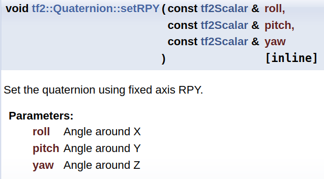
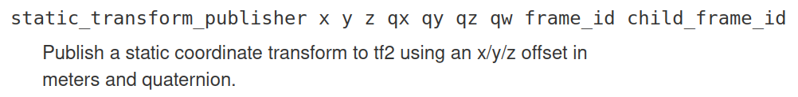
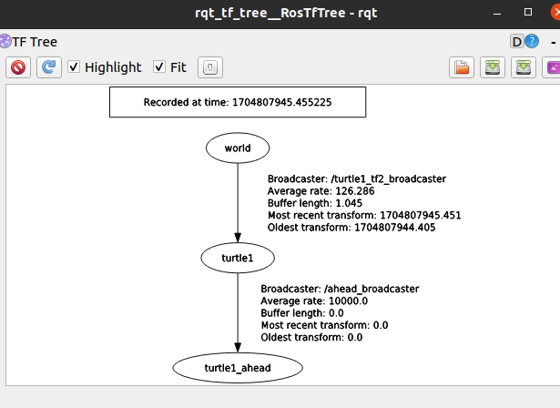
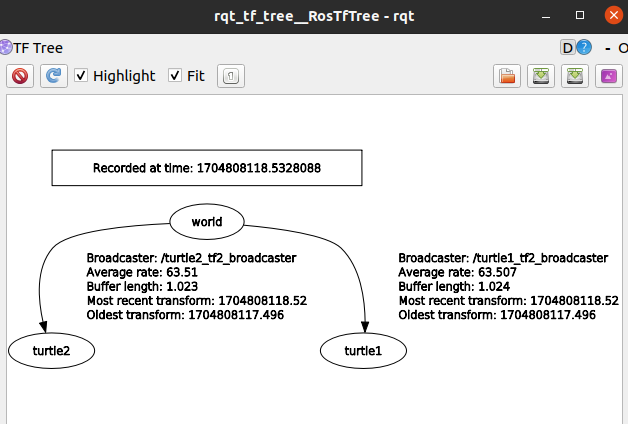

# Turtle TF2 Broadcaster
## CMakeLists.txt
```cmake
cmake_minimum_required(VERSION 2.8.3)
project(learning_tf2)

find_package(catkin REQUIRED COMPONENTS tf2 tf2_ros roscpp rospy turtlesim)

catkin_package()

include_directories(${catkin_INCLUDE_DIRS})

add_executable(turtle_tf2_broadcaster src/turtle_tf2_broadcaster.cpp)
add_executable(turtle_tf2_listener src/turtle_tf2_listener.cpp)

target_link_libraries(turtle_tf2_broadcaster
   ${catkin_LIBRARIES}
)
target_link_libraries(turtle_tf2_listener
   ${catkin_LIBRARIES}
)
```

+ tf2, tf2_ros package를 찾아줘야 함
```cmake
find_package(catkin REQUIRED COMPONENTS tf2 tf2_ros roscpp rospy turtlesim)
```

## package.xml
```xml
<?xml version="1.0"?>
<package format="2">
  <name>learning_tf2</name>
  <version>0.0.0</version>
  <description>The learning_tf2 package</description>

  <maintainer email="kim87@khu.ac.kr">Sanghyun Kim</maintainer>

  <license>TODO</license>

  <buildtool_depend>catkin</buildtool_depend>

  <depend>tf2</depend>
  <depend>tf2_ros</depend>
</package>
```

+ tf2에 대한 depend 추가
```xml
<depend>tf2</depend>
<depend>tf2_ros</depend>
```

## Code
```cpp
#include <ros/ros.h>
#include <tf2/LinearMath/Quaternion.h>
#include <tf2_ros/transform_broadcaster.h>
#include <geometry_msgs/TransformStamped.h>
#include <turtlesim/Pose.h>

std::string turtle_name;

void poseCallback(const turtlesim::PoseConstPtr& msg){
  static tf2_ros::TransformBroadcaster br;
  geometry_msgs::TransformStamped transformStamped;
  
  transformStamped.header.stamp = ros::Time::now();
  transformStamped.header.frame_id = "world";
  transformStamped.child_frame_id = turtle_name;
  transformStamped.transform.translation.x = msg->x;
  transformStamped.transform.translation.y = msg->y;
  transformStamped.transform.translation.z = 0.0;
  tf2::Quaternion q;
  q.setRPY(0, 0, msg->theta);
  transformStamped.transform.rotation.x = q.x();
  transformStamped.transform.rotation.y = q.y();
  transformStamped.transform.rotation.z = q.z();
  transformStamped.transform.rotation.w = q.w();

  br.sendTransform(transformStamped);
}

int main(int argc, char** argv){
  ros::init(argc, argv, "my_tf2_broadcaster");

  ros::NodeHandle private_node("~");
  if (! private_node.hasParam("turtle"))
  {
    if (argc != 2){ROS_ERROR("need turtle name as argument"); return -1;};
    turtle_name = argv[1];
  }
  else
  {
    private_node.getParam("turtle", turtle_name);
  }
    
  ros::NodeHandle node;
  ros::Subscriber sub = node.subscribe(turtle_name+"/pose", 10, &poseCallback);

  ros::spin();
  return 0;
};
```

## 구체적 분석
+ tf2::Quaternion을 사용하기 위한 include

+ tf2_ros::TransformBroadcaster object를 만들기 위한 include

+ geometry_msgs::TransformStamped object를 만들기 위한 include
```cpp
#include <tf2/LinearMath/Quaternion.h>

#include <tf2_ros/transform_broadcaster.h>

#include <geometry_msgs/TransformStamped.h>
```

### CallBack 함수
```cpp
void poseCallback(const turtlesim::PoseConstPtr& msg){
  static tf2_ros::TransformBroadcaster br;
  geometry_msgs::TransformStamped transformStamped;
  
  transformStamped.header.stamp = ros::Time::now();
  transformStamped.header.frame_id = "world";
  transformStamped.child_frame_id = turtle_name;
  transformStamped.transform.translation.x = msg->x;
  transformStamped.transform.translation.y = msg->y;
  transformStamped.transform.translation.z = 0.0;
  tf2::Quaternion q;
  q.setRPY(0, 0, msg->theta);
  transformStamped.transform.rotation.x = q.x();
  transformStamped.transform.rotation.y = q.y();
  transformStamped.transform.rotation.z = q.z();
  transformStamped.transform.rotation.w = q.w();

  br.sendTransform(transformStamped);
}
```

+ turtlesim의 pose를 subscribe하는 CallBack 함수
```cpp
void poseCallback(const turtlesim::PoseConstPtr& msg)
```

+ broadcaster
+ TransformStamped object
```cpp
static tf2_ros::TransformBroadcaster br;
geometry_msgs::TransformStamped transformStamped;
```

+ .stamp에 현재 시간을 저장
+ world에서 바라본 turtle_name에 대한 tf
+ .transformStamped에 translation에 대한 값 대입
```cpp
transformStamped.header.stamp = ros::Time::now();
transformStamped.header.frame_id = "world";
transformStamped.child_frame_id = turtle_name;
transformStamped.transform.translation.x = msg->x;
transformStamped.transform.translation.y = msg->y;
transformStamped.transform.translation.z = 0.0;
```

+ tf2::Quaternion msg 생성
+ RPY로 quaternion set
  
<p align="center">
    </img>
</p>

+ transformStamped에 rotation에 대한 값 대입
```cpp
tf2::Quaternion q;
q.setRPY(0, 0, msg->theta);
transformStamped.transform.rotation.x = q.x();
transformStamped.transform.rotation.y = q.y();
transformStamped.transform.rotation.z = q.z();
transformStamped.transform.rotation.w = q.w();
```

+ 값이 적용된 msg object transformStamped를 broadcast
```cpp
br.sendTransform(transformStamped);
```


### Main 문
```cpp
int main(int argc, char** argv){
  ros::init(argc, argv, "my_tf2_broadcaster");

  ros::NodeHandle private_node("~");
  if (! private_node.hasParam("turtle"))
  {
    if (argc != 2){ROS_ERROR("need turtle name as argument"); return -1;};
    turtle_name = argv[1];
  }
  else
  {
    private_node.getParam("turtle", turtle_name);
  }
    
  ros::NodeHandle node;
  ros::Subscriber sub = node.subscribe(turtle_name+"/pose", 10, &poseCallback);

  ros::spin();
  return 0;
};
```

+ 현재 노드에 대한 private NodeHandle 생성
```cpp
ros::NodeHandle private_node("~");
```

+ private NodeHandle를 이용하여 "/turtle"이라는 parameter가 있는 지 확인
  + 없을 때
    + turtle의 name이 arg로 주어지지 x: 실행을 종료하고 입력해 달라고 출력
    + turtle의 name이 arg로 주어지지 o: turtle_name에 arg을 대입
  
  + 있을 때: turtle이라는 parameter를 turtle_name에 대입
```cpp
if (! private_node.hasParam("turtle"))
{
    if (argc != 2){ROS_ERROR("need turtle name as argument"); return -1;};
    turtle_name = argv[1];
}
else
{
    private_node.getParam("turtle", turtle_name);
}
```

+ nodehandle을 만들고, turtle_name+"/pose" topic을 subscribe
```cpp
ros::NodeHandle node;
ros::Subscriber sub = node.subscribe(turtle_name+"/pose", 10, &poseCallback);
```

## start_demo.launch
```xml
<?xml version="1.0"?>
<launch>
    <node pkg="tf2_ros" type="static_transform_publisher"
          name="ahead_broadcaster" args="1 0 0 0 0 0 1 turtle1 turtle1_ahead" />
 
     <!-- Turtlesim Node-->
    <node pkg="turtlesim" type="turtlesim_node" name="sim"/>

    <node pkg="turtlesim" type="turtle_teleop_key" name="teleop" output="screen"/>
    <!-- Axes -->
    <param name="scale_linear" value="2" type="double"/>
    <param name="scale_angular" value="2" type="double"/>

    <node pkg="learning_tf2" type="turtle_tf2_broadcaster" args="/turtle1" name="turtle1_tf2_broadcaster" />

</launch>
```

+ turtle1의 head는 turtle1 frame기준으로 x=1, qw=1 임
<p align="center">
    </img>
</p>

```xml
<node pkg="tf2_ros" type="static_transform_publisher"
        name="ahead_broadcaster" args="1 0 0 0 0 0 1 turtle1 turtle1_ahead" />
```

+ 정확한 건 모르겠지만 scale_linear, scale_angular라는 parameter를 통해 turtle_teleop_key의 linear 부분과 angular 부분에 영향을 주고 있는 듯함. type은 double임
```xml
<param name="scale_linear" value="2" type="double"/>
<param name="scale_angular" value="2" type="double"/>
```

+ turtle_tf2_broadcaster node를 실행하는데, "/turtle1"를 args로 함

+ 이는 코드 상으로 "/turtle1/pose"를 subscribe하게 함
```xml
<node pkg="learning_tf2" type="turtle_tf2_broadcaster" args="/turtle1" 
    name="turtle1_tf2_broadcaster" />
```


### 만약, 아래와 같이 turtle2를 소환해준다면 어떻게 될까?
```
$ rosservice call /spawn "x: 3.0
y: 0.0
theta: 0.0
name: 'turtle2'" 
```
아래의 명령어를 통해 tf tree를 보면,turtle2에 대해서는 tf가 적용되지 않았음
```
$ rosrun rqt_tf_tree rqt_tf_tree
```
<p align="center">
    </img>
</p>


## start_demo_2.launch
```xml
<?xml version="1.0"?>
 <launch>
     <!-- Turtlesim Node-->
    <node pkg="turtlesim" type="turtlesim_node" name="sim"/>

    <node pkg="turtlesim" type="turtle_teleop_key" name="teleop" output="screen"/>
    <!-- Axes -->
    <param name="scale_linear" value="2" type="double"/>
    <param name="scale_angular" value="2" type="double"/>

    <node pkg="learning_tf2" type="turtle_tf2_broadcaster"
          args="/turtle1" name="turtle1_tf2_broadcaster" />
    <node pkg="learning_tf2" type="turtle_tf2_broadcaster"
          args="/turtle2" name="turtle2_tf2_broadcaster" />

    <node pkg="learning_tf2" type="turtle_tf2_listener"
          name="turtle1_tf2_listener" />
          
</launch>
```
+ 이 코드를 추가해 줌으로써 /turtle2에 대한 tf도 만들어주는 것임
```xml
<node pkg="learning_tf2" type="turtle_tf2_broadcaster"
        args="/turtle2" name="turtle2_tf2_broadcaster" />
```

이제 tf tree를 보면 turtle2도 적용되고 있다는 것을 알 수 있음
<p align="center">
    </img>
</p>

```
$ rostopic echo /tf
```
를 해도 world frame에 대하여 turtle1과 turtle2 모두 잘 나옴