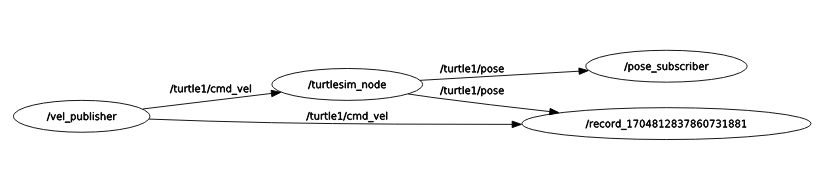

# Logging Tool
## Rosbag
실행하고 있는 msg 정보들을 담아두어 replay를 시켜준다.

+ Recoding
```
$ rosbag record -O filename.bag topic-names
```

+ Playbag
```
$ rosbag play filename.bag
```

+ Inspection
```
$ rosbag info filename.bag
```

### Example (terminal)
+ 4차시 예제 randvelturtlesim.launch을 실행시킨 뒤 속도와 pose를 저장해보자
```
$ rosbag record -O mybag.bag /turtle1/cmd_vel /turtle1/pose
```
아래와 같이 /turtle1/cmd_vel와 /turtle1/pose을 subscribe하고 있는 것을 알 수 있음

<p align="center">
    </img>
</p>

+ turtlesim_node를 킨 상태로, 아래와 같이 /turtle1/cmd_vel만 play하면
+ 이전에 움직였던 것과 같게 움직이게 됨
```
$ rosbag play mybag.bag --topics /turtle1/cmd_vel
```

### Example (ex_7.launch)
```xml
<launch>
  <arg name="filename" default="$(find urdf_tutorial)/../mybag.bag"/>
  <node
    pkg="turtlesim"
    type="turtlesim_node"
    name="turtlesim"
    respawn="true"
  />
  <node
      pkg="turtlesim"
      type="turtle_teleop_key"
      name="teleop_key"
      required="true"
      launch-prefix="xterm -e"
  />
  <node
     pkg="rosbag"
     type="play"
     name="play"
     args="$(arg filename)"
  />
 </launch>
```

+ args로 bag file을 줌으로써 실행시킬 수 있음
```xml
<node
     pkg="rosbag"
     type="play"
     name="play"
     args="$(arg filename)"
  />
```