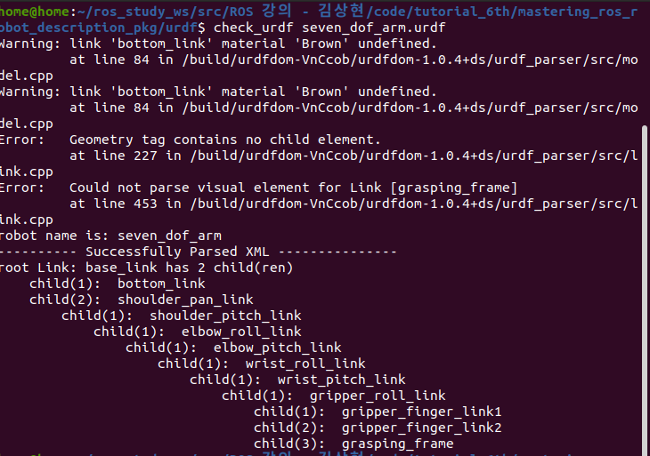
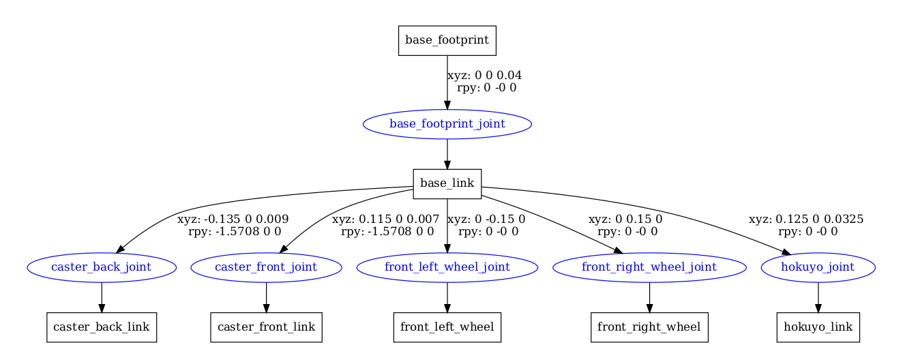

# Robot Modeling
## URDF (Unified Robot Description Format)
  + URDF는 XML 형태로 이루어져 있으며, robot, sensor, 주위 환경 및 물체 등을 묘사(description)해 놓은 파일

  + 로봇의 Kinematics 정보 (링크 길이가 얼마인지? 조인트 회전 방향이 어떤 방향인지?)
  + 로봇의 Dynamics 정보 (링크의 무게와 무게중심이 얼마인지? 바퀴의 마찰력이 얼마인지?)
  + 로봇의 visual mesh
  + 로봇의 collision mesh 등을 포함

## Main Tag
+ **Link Tag**는 로봇의 단일 링크의 성질(mass, inertia matrix, visual information) 등을 포함하는 파일
```xml
<link name="<name of the link>">
    <inertia>...</inertia>
    <visual>...</visual>
    <collision>...</collision>
</link>
```

+ **Joint Tag**는 로봇의 관절 타입 (revolute, continous, prismatic, fixed, floating 등)의 정보와 parent link와 child link 사이의 연결을 위한 정보들, 조인트 축, 마찰 정보, 댐핑 정보 등을 담고 있음
```xml
<joint name="<name of the joint>" type="<type of the joint>">
    <origin xyz="..." rpy="..."/>
    <parent link="link1"/>
    <child link="link2"/>
    <axis>"..."</axis>
    <dynamics damping="..."/>
    <limit effort="..."/>
</joint>
```

+ **Robot Tag**는 완전체의 로봇을 Wrapping하는 최상위 Tag
```xml
<robot name="<name of the robot>"/>
    <link>...</link>
    <link>...</link>
    <joint>...</joint>
    <joint>...</joint>
</robot>
```

## URDF 명령어
+ urdf에 대하여 warning과 error, 그리고 잘 된 부분을 보여줌
```
$ check_urdf urdf_name.urdf
```
<p align="center">
    </img>
</p>

+ urdf 구조가 pdf로 저장됨
```
$ urdf_to_graphiz urdf_name.urdf
```
<p align="center">
    </img>
</p>