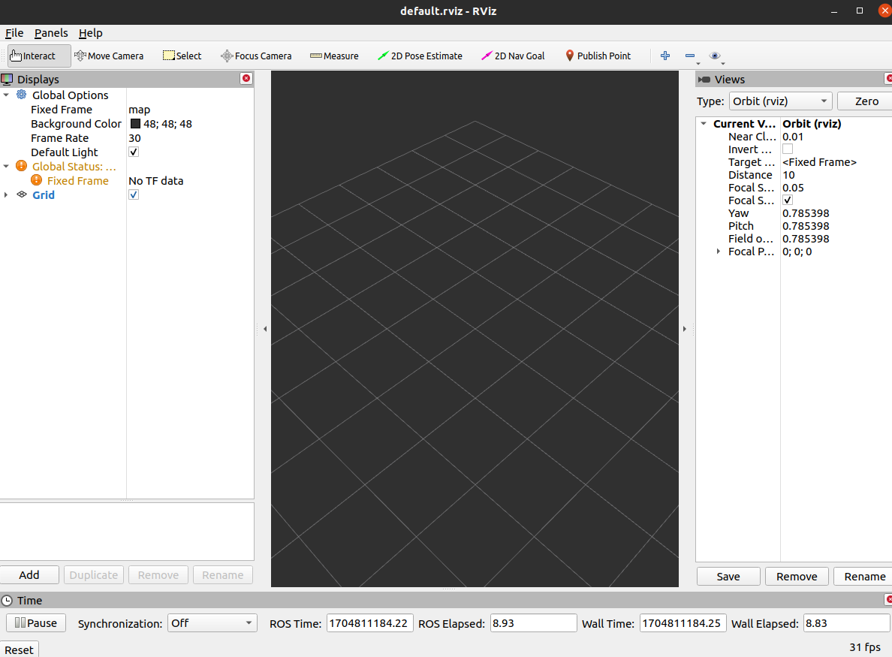

# Visualization Tool
## Rviz: 3d visualization Tool
+ 물리 엔진이 없는 visualizer
<p align="center">
    </img>
</p>

## robot_description_5.launch
```xml
<?xml version="1.0"?>
<launch>
  <param name="robot_description" textfile="$(find mastering_ros_robot_description_pkg)/urdf/pan_tilt.urdf" />
  
</launch>
```

+ "robot_description" 이라는 param에 urdf 정보를 넣은 것

+ 이렇게 되면 rviz에서 add로 model을 불러올 수 있음

+ 하지만, joint 정보가 주어지지 않았기 때문에 정보부족으로 로봇이 완전히 띄워지지 않음


## robot_description_rviz_6.launch
+ rviz까지 같이 켜지게 하는 launch file
```xml
<?xml version="1.0"?>
<launch>
  <param name="robot_description" textfile="$(find mastering_ros_robot_description_pkg)/urdf/pan_tilt.urdf" />
   
  <node 
    name="rviz" 
    pkg="rviz" 
    type="rviz" 
    args="-d $(find mastering_ros_robot_description_pkg)/urdf.rviz" 
    required="true" 
  />

</launch>
```

## urdf_tutorial_6.launch
### **Joint_State_Publisher**
이 node를 실행해야 완벽한 로봇의 형태를 띄울 수 있음. (로봇의 현재 관절 상태를 모르기 때문에)

### joint_state_publisher_gui
이 node로 joint도 publish해주고, joint제어를 gui로 할 수 있음

### **Robot State Publisher**
이 node를 실행해야 TF를 받아 볼 수 있음.

```xml
<?xml version="1.0"?>
<launch>
  <param name="robot_description" textfile="$(find mastering_ros_robot_description_pkg)/urdf/pan_tilt.urdf" />
  
  <!-- Starting joint publisher node which will publish the joint values -->
  <node 
    pkg="urdf_tutorial" 
    type="urdf_tutorial_template"
    name="joint_publisher" 
    launch-prefix="xterm -e"
  /> 
  
  <!-- Starting robot state publish which will publish tf -->
  <node 
    name="robot_state_publisher" 
    pkg="robot_state_publisher" 
    type="robot_state_publisher" 
  />
  
  <node 
    name="joint_state_publisher" 
    pkg="joint_state_publisher_gui" 
    type="joint_state_publisher_gui" 
  />

  <!-- Launch visualization in rviz -->
  <node 
    name="rviz" 
    pkg="rviz" 
    type="rviz" 
    args="-d $(find mastering_ros_robot_description_pkg)/urdf.rviz" 
    required="true" 
  />
</launch>
```