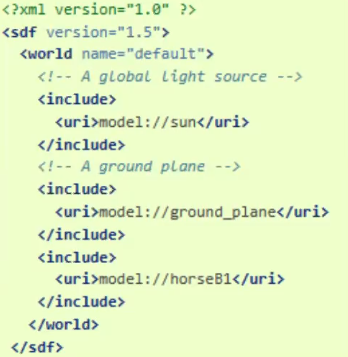

# Gazebo
### Gazebo - ROS Official Simulation
  + Rviz는 단순히 로봇을 3차원으로 표현해주는 도구이지만, gazebo는 물리엔진까지 포함하여, 실제 환경에서 로봇이 동작시키기 전 알고리즘 확인에 필수적 도구!

### Gazebo File들의 구성
#### World File
+ .world 확장자, 로봇, 빛, 외부 장애물 등을 정의한다.

+ 각 물체들은 SDF (simulation description format)으로 정의됨
<p align="center">
    </img>
</p>

#### Model File
+ .sdf 확장자, urdf와 마찬가지로 Link와 joint로 이루어져 있으며, plugin 또한 포함 (후술, 센서부분은 9차시 참고)

<p align="center">
    </img>
</p>

#### Plugin
+ 센서, System, Visual, GUI 등을 담고 있는 library

<p align="center">
    </img>
</p>

## (실습 2) Gazebo와 ROS를 연동해 본다
+ world를 불러옴
```
$ rosrun gazebo_ros gazebo `rospack find rrbot_gazebo`/worlds/rrbot.world
```
+ xacro, urdf file을 찾음
```
$ rosrun xacro xacro `rospack find rrbot_description`/urdf/rrbot.xacro > `rospack find rrbot_description`/urdf/rrbot.urdf
```
+ urdf file을 parameter로 등록
```
$ rosparam load `rospack find rrbot_description`/urdf/rrbot.urdf robot_description
```

+ model을 spawn
```
$ rosrun gazebo_ros spawn_model -param robot_description -urdf -model rrbot1 -robot_namespace rrbot1 -y 1
```
+ model을 spawn
```
$ rosrun gazebo_ros spawn_model -database coke_can -sdf -model coke_can -y 0.2 -x 0.2
```