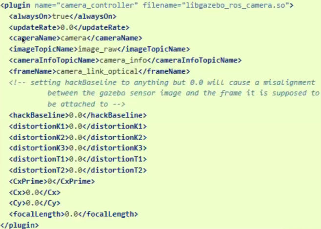

# Sensor

## Camera Sensor
+ ROS는 sensor_msgs::CameraInfo와 sensor_msgs::Image를 공식적으로 제공
  
### CameraInfo
카메라의 해상도, 왜곡 정보, 부착 frame 등을 publish

### Image
RGB 이미지를 0-255 level로 publish

<p align="center">
    </img>
</p>

### 실습 1
#### model.sdf를 관찰해 볼 것, 그 후 다음을 실행해 볼 것
+ gazebo 실행
```
$ roslaunch gazebo_sensors_tutorial camera_coke_gazebo2.launch
```
+ topic으로 camera 정보를 publish하여 simulator에서 나타나게 되는 것
```
$ rostopic list
$ rostopic echo /camera/camera_info
```
rviz 상에서도 볼 수 있음

add -> By topic -> camera로 추가할 수 있음
```
$ roslaunch gazebo_sensors_tutorial camera_coke_rviz2.launch
```

#### rrbot.gazebo (8차시 rrbot_description 폴더)를 관찰해 볼 것, 그 뒤 다음을 실행해 볼 것
+ camera가 robot에 달린 경우
+ rrbot_description/urdf/rrbot.xacro부터 거슬러 올라가며 살펴볼 것

+ gazebo launch
```
$ roslaunch rrbot_gazebo rrbot_world_2.launch
```

+ coke_can spawn
```
$ rosrun gazebo_ros spawn_model -database coke_can -sdf -model coke_can -y 0.5 -x -1.2
```

+ rviz launch
```
$ roslaunch rrbot_description rrbot_rviz_2.launch
```

## Depth Camera
+ sensor_msgs::PointCloud2도 공식적으로 제공

### 실습 2
#### models/Kinect-plugin.sdf를 관찰해 볼 것, 그 후 다음을 실행해 볼 것
+ gazebo 실행
```
$ roslaunch gazebo_sensors_tutorial kinect_coke_gazebo2.launch
```
+ rviz 실행
```
$ roslaunch gazebo_sensors_tutorial kinect_coke_rviz.launch
```

+ rviz에서 add/By topic 에서 camera에 대한 것들을 add 할 수 있음
+ depth를 보여줌

### Aruco_ROS를 이용한 QR 인식
+ aruco install
```
$ sudo apt install ros-noetic-aruco-ros
```
+ gazebo 실행
```
$ roslaunch gazebo_sensors_tutorial camera_gazebo2.launch
```
+ qr이 달린 cube spawn
```
$ rosrun gazebo_ros spawn_model -database aruco_cube -sdf -model aruco_cube  -x 0.11 -z 0.05
```
rviz 실행
```
$ rosrun gazebo_ros spawn_model -database pawnB1 -sdf -model pawnB1 -x 0.1 -y -0.1 -z 0.02
```